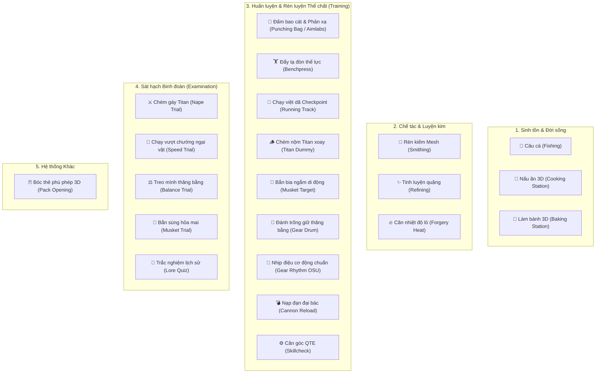

# Kiến trúc và Danh mục Mini-game (Requiem)

> **Tài liệu nguồn-thật cho toàn bộ hệ thống Mini-game & QTE trong codebase**  
> **Cập nhật:** 2026-09-13  
> **Trạng thái:** Phân tích kỹ thuật chuyên sâu từ mã nguồn client & shared Luau (`src/ReplicatedStorage`).

---

## 1. Mục đích và Phạm vi

Tài liệu này hệ thống hóa toàn bộ các mini-game, cơ chế phản xạ nhanh (QTE), trạm tương tác mô phỏng 3D và các bài kiểm tra thực chiến trong dự án **Requiem**. 

### Phạm vi mã nguồn:
- `ReplicatedStorage/Client/Interfaces/Routes/Screen/**`
- `ReplicatedStorage/Client/Interfaces/Routes/Pages/**`
- `ReplicatedStorage/Client/User/Miscellaneous/**`
- `ReplicatedStorage/Client/User/Equipment/Tools/Tools/**`
- `ReplicatedStorage/Common/Network/Namespaces/**`
- `ReplicatedStorage/Common/Types/**`

---

## 2. Bản đồ Tổng quan Hệ thống Mini-game

---

## 3. Phân tích Kỹ thuật Chi tiết Từng Mini-game

### 3.1. Mini-game Câu cá (Fishing System)

* **Vị trí tệp**:
  * Giao diện: [Fishing.luau](file:///d:/Requiem/src/ReplicatedStorage/Client/Interfaces/Routes/Screen/Fishing.luau)
  * Controller: [ClientFishingMinigameHandler.luau](file:///d:/Requiem/src/ReplicatedStorage/Client/User/Miscellaneous/ClientFishingMinigameHandler.luau)
  * Tool kích hoạt: [Fishing Rod.luau](file:///d:/Requiem/src/ReplicatedStorage/Client/User/Equipment/Tools/Tools/Fishing%20Rod.luau)
* **Thể loại**: Thanh đo giữ thăng bằng đối kháng trọng lực (Stardew Valley / Deepwoken style).
* **Cơ chế điều khiển**:
  * **Chuột trái (`MB1`)**: Gia tốc tăng tốc hướng lên (`velocity += 6.5 * dt`, nhân đôi lực nếu đang rơi).
  * **Chuột phải (`MB2`)**: Gia tốc ghì kéo hướng xuống (`velocity -= 8.5 * dt`, nhân đôi lực nếu đang nổi).
  * **Hãm tự nhiên**: Lực ma sát và trọng lực kéo thanh bar (`damping = 2.4`, khi thả cả hai chuột tăng lên `6.4`).
* **Hành vi mục tiêu (Cá)**:
  * Vị trí cá di chuyển ngẫu nhiên và mượt mà bằng nhiễu ngẫu nhiên (`0.4 + math.random() * 0.2`).
  * Tốc độ cá chịu ảnh hưởng bởi thuộc tính: `FishingFishSpeedMultiplier`.
* **Quy tắc thắng / thua**:
  * Khi thanh bắt cá trùm lên vị trí con cá: Thanh tiến độ tăng theo `FishingCatchFillMultiplier * 0.22`.
  * Khi lệch ra ngoài: Thanh tiến độ tụt theo `FishingCatchDrainMultiplier * 0.286`.
  * Đạt `1.0` (100%) $\rightarrow$ Bắt cá thành công. Tụt về `0.0` $\rightarrow$ Thất bại, đứt dây câu.

---

### 3.2. Mini-game Phản xạ & Ngắm bắn (Aimlabs Reflex)

* **Vị trí tệp**:
  * [Aimlabs.luau](file:///d:/Requiem/src/ReplicatedStorage/Client/Interfaces/Routes/Screen/Aimlabs.luau)
* **Thể loại**: Gridshot ngắm bắn thời gian thực.
* **Cơ chế**:
  * Các vòng tròn (`Circle`) spawn ngẫu nhiên trên màn hình.
  * Hiệu ứng xuất hiện: Nở ra từ kích thước `0x0` lên `100x100` trong `0.15s` (Easing: `Back`), sau đó co rút dần về `60x60` theo thời gian sống (`lifetime`).
  * **Tăng dần độ khó**:
    $$\text{lifetime} = \max(0.7 - \text{score} \times 0.02, 0.5)$$
  * Người chơi phải click chuột trái trực tiếp vào vòng tròn trước khi hết giờ.
  * Hết giờ mà chưa nhấp $\rightarrow$ Kích hoạt `onTimeout` $\rightarrow$ Thất bại / trừ mạng.

---

### 3.3. Căn góc xoay QTE (Skillcheck Minigame)

* **Vị trí tệp**:
  * [Skillcheck.luau](file:///d:/Requiem/src/ReplicatedStorage/Client/Interfaces/Routes/Screen/Skillcheck.luau)
  * Tích hợp: [Goblin.luau](file:///d:/Requiem/src/ReplicatedStorage/Client/Progression/Enchantments/Enchantments/Uncommon/Goblin.luau), [Sly Hands.luau](file:///d:/Requiem/src/ReplicatedStorage/Client/Progression/Enchantments/Enchantments/Rare/Sly%20Hands.luau)
* **Thể loại**: Kim xoay QTE vòng tròn (Dead by Daylight style).
* **Cơ chế tính toán góc**:
  * Kim quay với tốc độ góc:
    $$\omega = \left(90 + \frac{(u_{20} - 1) \times 410}{99}\right) \times \left(1 + \frac{\text{streak}}{\max(\text{targetStreak}, 1)}\right)$$
  * Vùng an toàn được sinh ngẫu nhiên từ `120°` đến `240°` với dung sai quét $\pm 20^\circ$.
  * Người chơi bấm phím **`Space`** để chặn kim.
  * **Hàm kiểm tra `onVerifyRotations`**: Xử lý góc xoay tuần hoàn modulo $360^\circ$.
  * Bấm chuẩn: Tích lũy streak, khi đủ số lần gọi `Player.Skillcheck.post(1)`.
  * Bấm trượt hoặc để kim quét qua vùng mà không bấm: Gửi `Player.Skillcheck.post(0)`, phát âm thanh `Universal.WoodBlockRattle`.

---

### 3.4. Huấn luyện Giữ thăng bằng ODMG (Gear Trainer Balancer)

* **Vị trí tệp**:
  * Tuyến giao diện: [Balancer.luau](file:///d:/Requiem/src/ReplicatedStorage/Client/Interfaces/Routes/Pages/Trainer/Balancer.luau)
  * Chế độ Drum: [BalancerMinigameMedium.luau](file:///d:/Requiem/src/ReplicatedStorage/Client/Interfaces/Routes/Pages/Trainer/Components/BalancerMinigameMedium.luau)
  * Chế độ Rhythm: [BalancerMinigameHard.luau](file:///d:/Requiem/src/ReplicatedStorage/Client/Interfaces/Routes/Pages/Trainer/Components/BalancerMinigameHard.luau)
  * Story test: [GearDrum.story.luau](file:///d:/Requiem/src/ReplicatedStorage/Client/Interfaces/Components/Screen/Stories/GearDrum.story.luau), [GearTrainer.story.luau](file:///d:/Requiem/src/ReplicatedStorage/Client/Interfaces/Components/Screen/Stories/GearTrainer.story.luau)

#### Chế độ A: Drumming Game (Easy/Medium)
* **Ý tưởng**: Luyện tập nhịp điệu chân ga và tay ga của bộ cơ động 3D.
* Các nốt nhịp (`KeyNode`) bay từ 2 mép biên (`Side = 0` hoặc `1`) tiến về tâm `0.5` với tốc độ `Node.Speed`.
* Phân loại màu nốt: Màu tím hồng (`#f696ff`) và màu xanh ngọc (`#6cffee`).
* Chấm điểm khi bấm phím:
  * `PERFECT`: Âm cao `Training.Hit` (pitch 1.1 - 1.3).
  * `HIT`: Âm thường `Training.Hit` (pitch 0.8 - 1.0).
  * `MISS`: Quá thời gian, nốt chuyển trạng thái dead, gọi `Scored(-1)`.

#### Chế độ B: Rhythm Game (Hard)
* **Ý tưởng**: Huấn luyện thao tác cơ động kết hợp di chuyển tâm ngắm (phong cách *OSU!*).
* Vòng tròn mục tiêu co nhỏ lại trên màn hình.
* Người chơi vừa phải rê chuột tới vùng mục tiêu:
  $$(\text{MousePosition} - \text{CircleAbsolutePosition}).\text{Magnitude} < \text{Scale}(100)$$
* Vừa phải bấm luân phiên phím **`Q`** và **`E`** (mô phỏng 2 cò neo cơ động ODMG):
  * Nếu bán kính co còn $< 0.2$: Đạt `PERFECT`.
  * Nếu bán kính co $< 0.5$: Đạt `GOOD`.
  * Không kịp bấm hoặc bấm trượt tâm: `MISS`.

---

### 3.5. Rèn vũ khí & Biến dạng Mesh động (Smithing Minigame)

* **Vị trí tệp**:
  * [MinigamePage.luau (Smithing)](file:///d:/Requiem/src/ReplicatedStorage/Client/Interfaces/Routes/Pages/Smithing/Subpages/MinigamePage.luau)
* **Điểm đột phá kỹ thuật**:
  * Sử dụng API tân tiến của Roblox: `AssetService:CreateEditableMeshAsync`.
  * Tải đồng thời 2 mesh: Mesh phôi thỏi kim loại gốc (`Asset 134575419415916`) và Mesh lưỡi kiếm thành phẩm (`Asset 92523533879481`).
  * Sử dụng thuật toán tìm kiếm đỉnh lân cận gần nhất (Nearest Vertex Search) để map toàn bộ đỉnh giữa thỏi sắt và thanh kiếm.
* **Cơ chế chơi**:
  * Các nốt bấm nhịp điệu xuất hiện trên giao diện đe rèn.
  * Mỗi nhát gõ trúng: Nhân vật thực hiện animation quai búa `Cinematics.SmithingHammerAction`, đe tóe ra chùm tia lửa hạt `Particles.deepEmitParticles`.
  * Hàm `updateEditableMeshAnimation` thực hiện nội suy:
    $$P_i(t) = \text{Lerp}(V_{\text{ingot}}[i], V_{\text{blade}}[i], t)$$
    với $t = \text{clamp}(\text{hits} / 7, 0, 1)$.
  * Sau **7 nhát đập chuẩn xác**, thỏi sắt phẳng dần biến đổi thành thanh kiếm sắc bén hoàn chỉnh trong không gian 3D.

---

### 3.6. Tinh luyện Khoáng sản (Refining Minigame)

* **Vị trí tệp**:
  * [MinigamePage.luau (Refining)](file:///d:/Requiem/src/ReplicatedStorage/Client/Interfaces/Routes/Pages/Refining/Subpages/MinigamePage.luau)
* **Thể loại**: Bám đuổi mục tiêu liên tục bằng con trỏ chuột (Cursor Tracking).
* **Cơ chế chuyển động**:
  * Vòng tròn tinh luyện di chuyển ngẫu nhiên trên màn hình bằng thuật toán lò xo vật lý (`Spring` motion), đồng thời kích thước vòng tròn co nhỏ dần từ `90px` xuống tới `50px`.
* **Cơ chế tính điểm**:
  * Mỗi frame (`RenderStepped`), tính khoảng cách từ con trỏ chuột tới tâm vòng tròn:
    $$d = \|(\text{MouseLocation} - \text{GuiInset}) - \text{CenterPosition}\|$$
  * Nếu $d \le \text{Radius}$: Nằm trong vùng, thanh tiến độ nạp nhanh:
    $$\text{progress} += 0.125 \times \Delta t$$
  * Nếu $d > \text{Radius}$: Trượt ra ngoài, tiến độ bị hao mòn:
    $$\text{progress} -= 0.05 \times \Delta t$$
  * Đạt $1.0$ (100%): Tinh chế quặng thành công. Tụt về $0.0$: Hỏng phôi quặng.

---

### 3.7. Căn nhiệt độ Lò rèn (Forgery Heat Management)

* **Vị trí tệp**:
  * [Forgery.luau](file:///d:/Requiem/src/ReplicatedStorage/Client/Interfaces/Routes/Pages/Forgery/Forgery.luau) (Component: `ForgeryHeatComponent`)
* **Thể loại**: Căn lực & duy trì áp suất/nhiệt độ (Thermodynamics bar).
* **Cơ chế**:
  * Thanh nhiệt độ lò rèn liên tục hạ nhiệt tự nhiên:
    $$\text{heat} -= 0.05 \times \Delta t$$
  * Người chơi nhấn nút **"Apply Heat"** để bơm bễ lò, kích hoạt luồng tăng nhiệt:
    $$\text{heat} += 0.4 \times \Delta t \quad (\text{kéo dài } 0.15\text{s})$$
  * Vùng nhiệt độ tối ưu (Sweet Spot) được sinh ngẫu nhiên ở một dải nhất định trên thanh đo.
  * Chỉ khi mức nhiệt nằm gọn trong vùng an toàn (`Ranged = true`), thợ rèn mới có thể thực hiện thao tác rèn ép kim loại tiếp theo.

---

### 3.8. Kỳ thi Sát hạch Tân binh (Cadet Corps Exams)

* **Vị trí tệp**:
  * [Nape.luau](file:///d:/Requiem/src/ReplicatedStorage/Client/Interfaces/Routes/Pages/Examination/Nape/Nape.luau)
* **Gồm 4 bài thi sát hạch thực chiến**:

| Bài thi | Mục tiêu kiểm tra | Thời gian / Giới hạn | Tiêu chí chấm điểm |
| :--- | :--- | :--- | :--- |
| **Nape Evaluation** | Chém gáy các Titan mô hình | 90 giây đếm ngược | Tối đa 20 gáy Titan. Điểm tối đa: 15 điểm. |
| **Speed Evaluation** | Vượt chướng ngại vật tính giờ | Tới `EXAM_SPEED_END` | Hoàn thành $\le 34$s: 15 điểm (tuyệt đối). $\ge 60$s: Thi trượt (0 điểm). |
| **Balance Evaluation**| Treo dây giữ thăng bằng trên giá | Liên tục | Điểm dựa trên thời lượng giữ thăng bằng không chạm đất (Max 10 điểm). |
| **Musket Evaluation** | Bắn súng hỏa mai bia ngắm | Giới hạn 5 phát đạn | Điểm dựa trên số lượng bia trúng đích (Max 10 điểm). |

---

### 3.9. Kỳ thi Trắc nghiệm Lịch sử Binh đoàn (Lore Quiz Exam)

* **Vị trí tệp**:
  * [Quiz.luau (Client)](file:///d:/Requiem/src/ReplicatedStorage/Client/Interfaces/Routes/Pages/Examination/Quiz/Quiz.luau)
  * [Quiz.luau (Dữ liệu câu hỏi)](file:///d:/Requiem/src/ReplicatedStorage/Common/Types/Quiz.luau)
* **Thể loại**: Trắc nghiệm kiến thức (4 lựa chọn).
* **Nội dung câu hỏi**:
  * Lịch sử các chiến dịch viễn chinh của Trinh Sát Đoàn (15th, 16th, 18th, 19th Expedition).
  * Các sự kiện thảm họa: Blackthorne Holding, sự xuất hiện của Titan Clicker, Titan Spider khổng lồ.
  * Lịch sử Hoàng gia và tường thành: Vua Illarion Fritz, Nữ hoàng Aurelia Fritz.
  * Sự phát triển của bộ cơ động 3D (ODMG) và tiền bối Thalrex Hayes.

---

### 3.10. Trạm Nấu ăn & Làm bánh 3D (Cooking & Baking Cinematic Stations)

* **Vị trí tệp**:
  * [ClientCookingHandler.luau](file:///d:/Requiem/src/ReplicatedStorage/Client/User/Miscellaneous/ClientCookingHandler.luau)
  * [ClientBakingHandler.luau](file:///d:/Requiem/src/ReplicatedStorage/Client/User/Miscellaneous/ClientBakingHandler.luau)
* **Thể loại**: Tương tác thực tế mô phỏng 3D kết hợp Cinematic Cutscene.
* **Cơ chế**:
  * Khi lại gần bếp và ấn tương tác, camera tự động khóa góc nhìn điện ảnh (`CameraType.Scriptable`).
  * Nhân vật chuyển sang trạng thái Cutscene và bước vào vị trí bếp.
  * Người chơi click chọn tối đa 3 nguyên liệu từ túi đồ: `Meat`, `Carrot`, `Onion`, `Potato`, `Tomato`.
  * Nước súp trong nồi đổi màu liên tục bằng phép nội suy màu `Color3:Lerp`:
    $$\text{SoupColor} = \text{Lerp}(\text{SoupColor}, \text{CookingColors}[j], 0.5)$$
  * Nhân vật thực hiện các hoạt ảnh thái rau củ, đảo muỗng và nấu súp đồng bộ cùng âm thanh nấu nướng.

---

### 3.12. Đẩy tạ đòn Thể lực (Benchpress Weight Training)

* **Vị trí tệp**:
  * [Benchpress.luau](file:///d:/Requiem/src/ReplicatedStorage/Client/Interfaces/Routes/Interactions/Types/Other/Benchpress.luau)
  * Animation: `rbxassetid://90444051694591` ([Default.luau](file:///d:/Requiem/src/ReplicatedStorage/Common/Animations/Default.luau))
* **Thể loại**: Tương tác thể hình (Gym Workout).
* **Cơ chế**:
  * Đặt tại các ghế tập tạ băng trong trại tân binh và doanh trại quân đội.
  * Khi tương tác (nếu không ở trạng thái bế/bị bế `CARRYING`), nhân vật nằm lên ghế băng, thực hiện hoạt ảnh nâng đẩy tạ đòn.
  * Gửi sự kiện `Interaction.Event.unreliablePost` lên máy chủ để tăng điểm rèn luyện và chỉ số **Sức mạnh (Strength)**.

---

### 3.13. Chạy Việt dã Theo Checkpoint (Running Track Training)

* **Vị trí tệp**:
  * [RunningClient.luau](file:///d:/Requiem/src/ReplicatedStorage/Client/World/Training/RunningClient.luau)
  * Mạng: `Player.Track` ([Player.luau](file:///d:/Requiem/src/ReplicatedStorage/Common/Network/Namespaces/Player.luau))
* **Thể loại**: Parkour / Chạy cự ly tính điểm (Track & Field).
* **Cơ chế**:
  * Kích hoạt trên các cung đường có gắn tag `Track` (`CollectionService:GetTagged("Track")`).
  * Khi chạm vạch xuất phát (`Checkpoint 1`), hệ thống bật tia chỉ đường `Beam` dẫn sang điểm chốt kế tiếp.
  * Người chơi phải chạy tuần tự qua các mốc `1 -> 2 -> ... -> N`. Mỗi chốt chạm đích phát âm thanh `Universal.GlassyPop` với cao độ tăng dần.
  * Chạm chốt cuối cùng (hoàn thành cung đường): Tự động gọi `Player.Track.post()` lên server để nhận điểm kinh nghiệm Thể lực & Tốc độ chạy (Agility / Stamina).

---

### 3.14. Tập Chém Nộm Titan Xoay (Titan Dummy Training)

* **Vị trí tệp**:
  * [TitanDummy.luau](file:///d:/Requiem/src/ReplicatedStorage/Client/World/Training/TitanDummy.luau)
* **Thể loại**: Huấn luyện chiến đấu mô phỏng (Combat Target Simulation).
* **Cơ chế**:
  * Các giá nộm Titan gỗ (`CollectionService:GetTagged("Titan Dummy")`) tự động xoay chuyển các góc $180^\circ$ ngẫu nhiên bằng TweenInfo (thời lượng 5 giây) để mô phỏng Titan chuyển hướng.
  * Người chơi dùng dây móc ODMG tiếp cận và chém vào sau gáy nộm.
  * Khi chém trúng gáy: Nộm kích hoạt thuộc tính `Knocked`, nghiêng gập người ngã gục xuống góc $-80^\circ$ trong 3 giây. Sau 7 giây sẽ tự phục hồi dựng đứng dậy để tiếp tục luyện tập.

---

### 3.15. Bắn Bia Ngắm Di động (Musket Target Practice)

* **Vị trí tệp**:
  * [MusketTarget.luau](file:///d:/Requiem/src/ReplicatedStorage/Client/World/Training/MusketTarget.luau)
* **Thể loại**: Trường bắn mục tiêu di động (Target Shooting Range).
* **Cơ chế**:
  * Các tấm bia ngắm bắn (`CollectionService:GetTagged("Target")`) liên tục trượt qua lại giữa 2 mốc tọa độ `Start` và `End` theo chu kỳ sóng sin 2 giây (Easing: `Sine`, Direction: `InOut`, lặp vô tận).
  * Giúp binh lính tân binh rèn luyện kỹ năng canh độ trễ đường đạn và đón đầu mục tiêu khi ngắm bắn súng hỏa mai (Musket).

---

### 3.16. Nạp đạn Đại bác Thành lũy (Cannon & Howitzer Reloading)

* **Vị trí tệp**:
  * [CannonReload.luau](file:///d:/Requiem/src/ReplicatedStorage/Client/Interfaces/Routes/Interactions/Types/Other/CannonReload.luau)
  * [Cannon.luau](file:///d:/Requiem/src/ReplicatedStorage/Client/Interfaces/Routes/Interactions/Types/Other/Cannon.luau)
* **Thể loại**: Vận hành pháo binh thực tế (Artillery Operation).
* **Cơ chế**:
  * Người chơi trang bị đạn pháo trong túi đồ (`hasCannonballEquipped() == true`).
  * Tiếp cận buồng nạp pháo, khóa trạng thái `CANNON_RELOADING`, tạm thời giảm WalkSpeed và JumpPower để vác đạn.
  * Chạy hoạt ảnh nhồi đạn vào nòng pháo `Cannonball.Reload`.
  * Sau khi nạp xong, gửi `Interaction.Event.unreliablePost` để nạp đạn vào hệ thống pháo, sẵn sàng ngắm bắn tiêu diệt Titan từ trên mặt thành.

---

## 4. Bảng Tra cứu Nhanh Toàn bộ Mini-game & Hoạt động Training

| Tên Hoạt động | Đường dẫn chính | Cơ chế cốt lõi | Yêu cầu thao tác | Mục đích chính |
| :--- | :--- | :--- | :--- | :--- |
| **Punching Bag** | `Interactions/Types/Other/Punching Bag` | Đấm bao cát + Gridshot | Click vòng tròn phản xạ | Rèn phản xạ, cày EXP đấm bốc |
| **Benchpress** | `Interactions/Types/Other/Benchpress` | Nằm đẩy tạ đòn | Tương tác ghế tập tạ | Rèn chỉ số Sức mạnh (Strength) |
| **Running Track**| `World/Training/RunningClient.luau` | Chạy theo Checkpoint chùm tia | Chạy qua các chốt thứ tự | Rèn Tốc độ & Thể lực (Agility) |
| **Titan Dummy** | `World/Training/TitanDummy.luau` | Nộm Titan tự xoay $180^\circ$ | Phóng móc ODMG & chém gáy | Luyện bay lượn và chém gáy |
| **Musket Target**| `World/Training/MusketTarget.luau` | Bia trượt di động hình sin | Ngắm bắn súng hỏa mai | Luyện ngắm đón đầu mục tiêu |
| **Gear Drum** | `Trainer/BalancerMinigameMedium` | Nhịp điệu Taiko 2 phía | Phím nhịp | Luyện giữ thăng bằng ODMG |
| **Gear Rhythm**| `Trainer/BalancerMinigameHard` | Nhắm tâm & nhịp phím (OSU) | Rê chuột + phím `Q` & `E` | Mở bùa Rhythmatic, EXP Gear |
| **Cannon Reload**| `Interactions/Types/Other/CannonReload`| Vác đạn & nhồi buồng pháo | Trang bị đạn + nạp đạn | Phòng thủ tường thành |
| **Nape Trial** | `Examination/Nape/Nape.luau` | Chém gáy Titan trong 90s | Cơ động ODMG + Chém gáy | Thi tốt nghiệp tân binh |
| **Speed Trial**| `Examination/Nape/Nape.luau` | Chạy vượt địa hình tính giờ | Parkour / Chạy đua | Thi tốc độ tân binh |
| **Musket Trial**| `Examination/Nape/Nape.luau`| Bắn 5 phát đạn vào bia | Ngắm và bắn bia | Thi xạ thủ tân binh |
| **Balance Trial**| `Examination/Nape/Nape.luau`| Giữ thăng bằng trên giá treo | Thăng bằng không chạm đất | Thi thăng bằng tân binh |
| **Lore Quiz** | `Examination/Quiz/Quiz.luau` | Trắc nghiệm cốt truyện | Chọn 1 trong 4 đáp án | Thi lý thuyết quân đội |
| **Fishing** | `Screen/Fishing.luau` | Thanh trượt trọng lực | Chuột Trái & Phải | Câu cá kiếm tài nguyên |
| **Smithing** | `Smithing/MinigamePage.luau` | Biến dạng `EditableMesh` | Phím nhịp đập đe | Rèn vũ khí & gươm katana |
| **Refining** | `Refining/MinigamePage.luau` | Bám đuổi vòng tròn lò xo | Giữ chuột trong vòng | Tinh luyện quặng kim loại |
| **Forgery Heat**| `Forgery/Forgery.luau` | Duy trì nhiệt độ trong dải | Nhấn nút "Apply Heat" | Căn nhiệt độ lò rèn |
| **Cooking 3D** | `Miscellaneous/ClientCookingHandler`| Chọn nguyên liệu + Cutscene | Chọn rau củ thả vào nồi | Nấu súp tăng buff |
| **Baking 3D** | `Miscellaneous/ClientBakingHandler` | Nướng bánh 3D + Cutscene | Đưa bột vào lò nướng | Làm bánh mì sinh lực |
| **Card Pack** | `Pages/Enchantment/Pack.luau` | Xé gói và lật bài 3D | Kéo xé và click lật bài | Mở thẻ bùa chú 3D |

---
*Tài liệu được biên soạn tự động và lưu trữ tại `docs/MINIGAMES-ARCHITECTURE.md`.*
