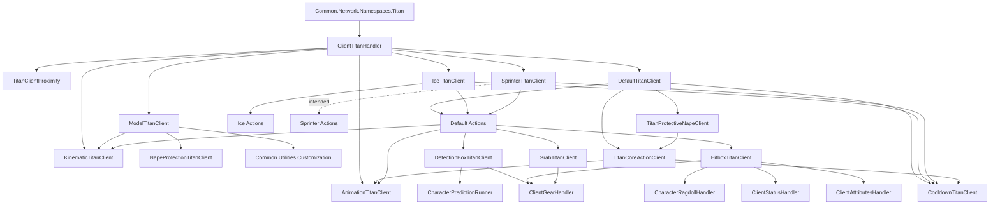

# Kiến trúc Titan Client

> Tài liệu nguồn-thật cho `src/ReplicatedStorage/Client/Entities/Titans`  
> Cập nhật: 2026-07-18  
> Trạng thái: phân tích từ source Luau đã decompile; chưa xác nhận bằng Roblox runtime

## 1. Mục đích và phạm vi

Tài liệu này mô tả kiến trúc Titan phía client dựa trên hành vi thể hiện trong code, không dựa riêng vào tên file hoặc tài liệu cũ.

Phạm vi chính:

- `ReplicatedStorage/Client/Entities/Titans/ClientTitanHandler.luau`
- `ReplicatedStorage/Client/Entities/Titans/Types/**`
- `ReplicatedStorage/Client/Entities/Titans/Utilities/**`
- Các module bên ngoài được Titan client gọi trực tiếp
- `ReplicatedStorage/Common/Network/Namespaces/Titan.luau`
- `ReplicatedStorage/Common/Types/Titan*.luau`

Không có implementation Titan server trong repository hiện tại. Vì vậy, tài liệu có thể xác nhận client gửi và nhận dữ liệu gì, nhưng không thể xác nhận server kiểm duyệt action như thế nào.

## 2. Kết luận kiến trúc

Titan client là một hệ thống client prediction hướng vào local player:

1. Server tạo server rig và gửi metadata Titan cho client.
2. Client dựng display rig, ẩn collider rig của server và weld hai rig lại với nhau.
3. Mỗi client tự đánh giá Titan nào có khả năng đánh trúng chính local player.
4. Client gửi đề xuất action qua unreliable transport.
5. Khi nhận action được phát lại qua network, client chạy animation-side behavior, IK, hitbox và hiệu ứng local.
6. Khi hitbox local xác nhận va chạm, client gửi `Titan.Respond` về server.

Đây không phải behavior tree hoàn chỉnh. Nó là một prioritized action scanner gồm:

- bộ lọc theo khoảng cách;
- cooldown/state gate;
- prediction bằng detection box;
- ưu tiên action;
- request/execute/respond qua network.

## 3. Bản đồ module



Mũi tên nét đứt từ Sprinter tới Sprinter Actions là liên kết có vẻ được thiết kế nhưng chưa được load trong source hiện tại.

## 4. Runtime prerequisites

Hệ thống mong đợi các object không nằm đầy đủ trong snapshot filesystem hiện tại:

- `workspace.Titans`: chứa server rig theo tên `tostring(titanId)`.
- `workspace.TitanGoals`: được khai báo trong common Titan type nhưng không được Titan client dùng trực tiếp.
- `ReplicatedStorage.Assets.Titans`: display models, `Default`, variant models và `Hairs`.
- `ReplicatedStorage.Assets.Titans.Hitboxes.Detections.HumanoidRootPart`.
- `ReplicatedStorage.Assets.Titans.Hitboxes.Detections.Lookup`: các part đặt tên dạng `<Move>.<Side>`.
- `ReplicatedStorage.Common.Animations.Titans`: animation IDs.
- `ReplicatedStorage.Common.Sounds.Titans`: sound IDs.

Nếu `Assets.Titans` không được cung cấp bởi place gốc hoặc một source ngoài Rojo, `WaitForChild()` trong model/detection layer sẽ chờ vô hạn.

## 5. Dữ liệu runtime của một Titan

`ClientTitanHandler` tạo một record cho mỗi Titan:

| Field | Nguồn | Vai trò |
|---|---|---|
| `id` | create payload | Khóa registry và network identity |
| `scale` | create payload | Scale model, detection box và nhiều khoảng cách |
| `variant` | create payload | Chọn `default`, `ice` hoặc `sprinter` client |
| `isSupporter` | create payload | Chặn một số action với supporter Titan |
| `displayModel` | create payload | Chọn display rig trong assets |
| `hair` | create payload | Chọn accessory tóc |
| `attributes` | create payload được code sử dụng | `primary`, `secondary`, `tertiary` action groups |
| `model.server` | workspace | Collider/server rig bị làm trong suốt |
| `model.client` | clone từ assets | Display rig, animation và hitbox source |
| `root` | server rig | `HumanoidRootPart`, dùng cho distance và weld |
| `animator` | client rig | Load animation track |
| `animations` | local table | Track registry theo animation key |
| `cooldowns` | local array | Cooldown `{name, duration, time}` |
| `cleanup` | Trove | Resource của action đang chạy |
| `destroy` | Trove | Resource sống suốt vòng đời Titan |
| `signals.destroy` | Signal | Đường cleanup local do death action kích hoạt |
| `awake` | local state | Wakeup action gate |
| `inactive` | local state | Ngăn decision/action mới |
| `throttle` | scheduler inject | Callback thay đổi chu kỳ update |

Điểm lệch contract: `attributes` được handler/variant sử dụng nhưng không xuất hiện trong schema payload nhìn thấy ở `Common/Network/Namespaces/Titan.luau`.

## 6. Lifecycle

### 6.1 Khởi động

Khi module handler được require:

1. Require ba variant client.
2. Đăng ký listener cho `Create`, `Animate`, `Action`, `Destroy`.
3. Khởi tạo `TitanClientProximity`.
4. Gửi `Titan.Batch.post({})` để yêu cầu danh sách Titan hiện hữu.
5. Đăng ký listener nhận batch.

Handler export hai API read-only:

- `getTitanById(id)`
- `getTitans()`

### 6.2 Tạo Titan

`onTitanCreated(payload)` gọi `ModelTitanClient.onTitanModelCreated`:

1. Tìm `workspace.Titans[tostring(id)]`.
2. Chờ server `HumanoidRootPart`.
3. Clone display model, gắn hair, gọi `ScaleTo(scale)`.
4. Ghi bind-pose/kinematic origins.
5. Pivot display rig tới server rig.
6. Weld hai root part.
7. Làm trong suốt server rig, gắn tag `Collider`, tắt collision.
8. Gắn tag `Alive`, `Titan`, attribute `id` cho display model.
9. Tạo `AnimationController` và `Animator` trên display rig.
10. Áp dụng visual nape protection lần đầu.

Sau đó handler tạo Titan record và đăng ký callback vào shared throttle scheduler.

### 6.3 Update và LOD

`ClientTitanHandler` làm coarse gate:

- Không có local root: chuyển sang variant để variant đặt throttle `2s`.
- `mid`: đặt throttle `1.5s`, không chạy decision loop.
- `idle`: đặt throttle `8s`, không chạy decision loop.
- `near`: gọi variant `onTitanStepped`.

Variant làm fine gate lần hai:

1. Kiểm tra local root và distance.
2. Tự cập nhật near throttle.
3. Chặn khi player đang `CUTSCENE`, `ERADICATING` hoặc `FREECAM`.
4. Xin một action-cycle slot trong frame.
5. Chạy action selection.

### 6.4 Đề xuất action

Action selection gọi `action.attempt(titan, attributeValue)`.

Nếu `attempt` trả về `true, ...`, variant gửi:

```luau
Titan.Action.unreliablePost(titan.id, actionName, ...)
```

`attempt` là speculative phase. Nó có thể đặt cooldown `*Attempt` trước khi server phản hồi để tránh spam request.

### 6.5 Nhận và execute action

Handler chuyển event tới variant:

```luau
variant.onActionReceived(titan, actionName, requestToken, subject, ...)
```

Variant thực hiện:

1. Tìm action module theo tên trong action registry.
2. Đánh dấu `coreReaction` nếu đây là core action.
3. Chặn nape interrupt nếu core reaction/animation đang chạy.
4. `titan.cleanup:Clean()` để kết thúc action trước.
5. Chặn nếu Titan đang `dying` hoặc `inactive`.
6. Gọi `action.execute(titan, cleanup, subject, respond, ...)`.

Callback `respond(...)` gửi:

```luau
Titan.Respond.unreliablePost(titan.id, requestToken, ...)
```

### 6.6 Death và destroy

Có hai đường khác nhau:

- `Titan.Destroy.listen(id)` chỉ đặt `titan.inactive = true`.
- `DefaultTitanDead.execute()` đặt inactive, khóa limb/bite 100 giây, fire `titan.signals.destroy`, rồi fade display parts.

Signal destroy mới gọi `onDestroyTitan`, xóa registry, dừng scheduler callback và xóa look-at state.

Do đó network `Destroy` một mình không xóa record trong source hiện tại. Đây là khác biệt quan trọng giữa “inactive” và “fully disposed”.

## 7. Action selection engine

### 7.1 Action registry

Mỗi folder con của `Actions` là một action group:

- `Default`: action phổ thông và server-driven core actions.
- `Anger`: bite/ground/air attacks.
- `Idiocy`: ground attack riêng.
- `Ice`: action variant Ice.
- `Sprinter`: action variant Sprinter dự kiến.

Variant giữ hai index:

- map `group -> actionName -> module` để dispatch network action;
- sorted list `group -> [{name, module}]` để chạy decision loop.

### 7.2 Priority và range

Sort rule:

1. Action có numeric `priority` đứng trước action không có priority.
2. Số nhỏ hơn có ưu tiên cao hơn.
3. Nếu cùng loại/cùng priority, sort theo `actionName` tăng dần.

`engageRangeStuds` là optional. Nếu thiếu, loader suy ra:

| Pattern tên | Range suy ra |
|---|---:|
| `ShortRange` | 120 |
| `MediumRange` | 250 |
| `LongRange` | 450 |
| `WideRange` | 500 |
| `AngryStomp`, `IceGroundSlam` | 200 |

Action không có range suy ra vẫn được gọi; module phải tự kiểm tra điều kiện.

### 7.3 Thứ tự decision

Thứ tự thực tế:

1. Chặn nếu cooldown `eating`, `blinded`, `dying` hoặc inactive.
2. Thử `NapeGrabAttack` như phản xạ bảo vệ ưu tiên cao, trừ khi core action đang chạy.
3. Duyệt `primary`, `secondary`, `tertiary` theo đúng thứ tự payload.
4. Trong mỗi group, thử action theo sorted priority.
5. Nếu chưa chọn, duyệt group `Default`, bỏ qua `NapeGrabAttack` vì đã thử trước.
6. Ice thử thêm group `Ice` sau Default.
7. Sprinter có code thử group `Sprinter`, nhưng group này không được load trong source hiện tại.
8. Dừng ở action đầu tiên trả về thành công.

### 7.4 Variant policy

| Variant | Action source | Policy |
|---|---|---|
| `default` | Default folders | Supporter Titan bị chặn `LongRangeAttackAir` và `LongRangeAttackGround`; core actions tên `DefaultTitan*` luôn được cho qua |
| `ice` | Default + Ice folders | Chặn danh sách `ICE_DISABLED_ACTIONS`, sau fallback Default mới thử Ice action |
| `sprinter` | Hiện chỉ load Default folders | Có copy của Ice policy nhưng điều kiện kiểm tra `variant ~= "ice"`, nên Sprinter thực tế không bị filter; Sprinter folder không được load |

Ba variant đang copy gần như toàn bộ loader, selection và dispatch code. Đây là duplication boundary lớn nhất của hệ thống.

## 8. Action module contract

Contract thực tế:

```luau
return {
    priority = 1, -- optional; số nhỏ hơn chạy trước
    engageRangeStuds = 120, -- optional; có thể được loader suy ra
    detection = moveDetectionConfig, -- optional; phục vụ debug/introspection

    attempt = function(titan, attributeValue)
        -- speculative local checks
        -- return false
        -- hoặc return true, actionArguments...
    end,

    execute = function(titan, cleanup, subject, respond, ...)
        -- tạo local hitbox/IK/effect
        -- cleanup:Add(resource)
        -- respond(hitData...) khi local hit được xác nhận
    end,
}
```

Player distance không được truyền vào `attempt`. Variant dùng distance để lọc `engageRangeStuds` trước khi gọi.

Các action `DefaultTitan*` thường có `attempt = false`; chúng là reaction/lifecycle action do server phát xuống, không phải action được client tự đề xuất.

## 9. Action catalog

### Default combat

| Nhóm | Action | Vai trò |
|---|---|---|
| Grab | `ShortRangeGrab`, `ShortRangeFrontArmGrab`, `ShortRangeGrabLeg`, `MediumRangeGrab`, `LongRangeGrab`, `LongRangeAboveGrab`, `WideRangeGrab`, `SidewaysGrab` | Detection theo box/impact time, chọn side, tạo arm hitbox, gửi limb hit về server |
| Positional grab | `BackGrab` | Ưu tiên player phía sau, có proximity/grapple fallback |
| Nape defense | `NapeGrabAttack` | Phản xạ bảo vệ gáy; priority 0; dùng vị trí, hướng và trạng thái grapple |
| Nape defense | `NapeGrabSwats` | Quét player/dây ở vùng gáy |
| Swat | `ShortRangeSwat` | Detection chuẩn cộng close/approach/grapple fallback |
| Kick | `MediumRangeKick`, `LongRangeKick` | Leg hitbox, knockback và concussion |
| Ground attack | `ShortRangeAttackGround` | Arm ground hitbox, tạm suppress look-at |
| Stomp | `AngryStomp` | Leg hitbox, ragdoll, ungrapple, concussion và launch |
| Face defense | `EyeGrabAttack` | Phát hiện grapple gần mặt/mắt rồi tạo hand hitbox |
| Grapple reaction | `GrappleJumpShake` | Phản ứng khi player bám Titan, shake/ung grapple/ragdoll; `Clear Mind` ảnh hưởng kết quả |

### Attribute combat

| Group | Action | Vai trò |
|---|---|---|
| `Anger` | `LongRangeAttackAir` | Air arm attack, animation/hitbox window |
| `Anger` | `LongRangeAttackGround` | Ground strike, environmental hitbox và local crowd-control |
| `Anger` | `LongRangeBite` | Curved prediction, bite aim IK, mouth hitbox |
| `Anger` | `MediumRangeBite` | Bite prediction ở khoảng gần hơn |
| `Idiocy` | `MediumRangeAttackGround` | Ground limb hitbox đơn giản hơn |

### Core/reaction/lifecycle

| Action | Vai trò |
|---|---|
| `DefaultTitanWakeup` | Client có thể đề xuất wakeup khi grapple giữ đủ lâu; set `awake = true` |
| `DefaultTitanBlinded` | Khóa `blinded` theo animation length và suppress look-at |
| `DefaultTitanArmCut` | Khóa hai arm theo animation length cộng recovery |
| `DefaultTitanLegCut` | Khóa arm, leg và bite theo animation length |
| `DefaultTitanEating` | Gắn grabbed character vào hand; khóa state `eating` |
| `DefaultTitanChewing` | Giữ local player tại head/mouth, chạy animation `Eaten` |
| `DefaultTitanDead` | Inactive, khóa toàn bộ attack, phát local destroy signal và fade model |

### Variant

| Variant | Action | Trạng thái |
|---|---|---|
| Ice | `IceGroundSlam` | Hoạt động theo thiết kế; tái sử dụng detection box `AngryStomp` |
| Sprinter | `Temp` | Stub: `attempt` và `execute` đều trả false; hiện không được loader nạp |

## 10. Utility modules nội bộ

### `TitanClientProximity`

Trách nhiệm:

- cache local `HumanoidRootPart.Position` mỗi `RenderStepped`;
- tính distance tới Titan root;
- phân tier;
- tính dynamic near throttle;
- giới hạn tối đa ba action cycles mỗi render frame.

| Tier | Distance | Throttle |
|---|---:|---:|
| `near` | `<= 600` | `clamp(distance / 2000, nearMin, 1)` |
| `mid` | `<= 1200` | `1.5s` |
| `idle` | `> 1200` | `8s` |
| `unknown` | Không có distance | `3s`; variant thường dùng no-character `2s` |

`nearMin = clamp(0.075 + max(0, activeTitanCount - 20) * 0.01, 0.075, 0.35)`.

Near không có nghĩa là update mỗi frame. Với nhiều Titan, minimum interval tăng để giảm tải.

Rủi ro fairness: budget reset mỗi frame nhưng scheduler giữ thứ tự callback. Các Titan thường xuyên cùng đến hạn có thể khiến những callback đứng sau liên tục hụt budget.

### `CooldownTitanClient`

Cooldown là array local dùng `os.clock()`:

- `isOnCooldown(titan, nameOrNames)`
- `getCooldownRemaining(titan, name)`
- `addClientCooldown(titan, nameOrNames, duration)`
- `removeClientCooldown(titan, nameOrNames)`
- `cleanupExpiredCooldowns(titan)`

Các cooldown cũ không tự xóa; lookup vẫn đúng vì kiểm tra elapsed time, nhưng array chỉ co lại khi cùng tên được thay thế hoặc có nơi gọi cleanup.

### `DetectionBoxTitanClient`

Đây là decision/prediction layer, không phải damage hitbox.

Luồng chính:

1. Load detection boxes từ asset `Lookup` và quy đổi về local space của mẫu root.
2. Scale và transform boxes theo `titan.root.CFrame` và `titan.scale`.
3. Tính impact horizon từ `impactAt`, animation speed, distance và movement mode.
4. Cộng latency buffer từ `LocalPlayer:GetNetworkPing()`.
5. Lấy prediction từ `CharacterPredictionRunner` hoặc gear-specific prediction.
6. Kiểm tra outer/inner box, side, impact window, proximity plane và mouth reach.
7. Trả `true, side` nếu một action có khả năng bắt trúng local player.

Module có cache theo Heartbeat frame cho transformed boxes, impact-window positions và prediction samples. Nó cũng có debug history/report và vẽ debug point/hitbox qua `Draw`.

### `HitboxTitanClient`

Đây là execution/collision layer:

- `createLimbHitbox`: theo dõi các part của arm/leg trong animation window và phát signal tên limb bị chạm.
- `createMouthHitbox`: kiểm tra khoảng cách/facing từ mouth tới character.
- `onKnockbackFromLimb`: local ragdoll, ungrapple và velocity impulse.
- `onCreateTitanVersusTitanHitox`: overlap box với tag `ServerTitan`.
- `onCreateEnvironmentalHitbox`: spherecast tới model `Destructible`, `House` hoặc `Cannon`.

Limb hitbox còn kiểm tra wire/grapple sweep. Kết quả phụ thuộc:

- `GearGrappleSwatResistanceMultiplier`;
- `HasDeepHooks`;
- cấu hình `wires.shake`, `concuss`, `ungrapple`, `ragdoll`, `threshold`;
- trạng thái gear và các grapple đang active.

### `KinematicTitanClient`

Quản lý ba lớp chuyển động:

- generic limb IK (`createKinematicInfluence`);
- look-at (`createLookAtInfluence`, `updateKinematicLookAt`);
- bite-specific IK/aim (`createBiteIKInfluence`, `createBiteAimInfluence`).

Module lưu state theo Titan id cho bind pose, damping, suppression và bite runtime. `suppressLookAtFor`, `cancelLookAtSuppression` và `snapLookAtMotorsToBindPose` giúp action không đánh nhau với look-at nền.

### `AnimationTitanClient`

Trách nhiệm:

- cache `Animation` object theo asset id;
- preload toàn bộ `Common.Animations.Titans` một lần;
- bù `workspace:GetServerTimeNow()` để sync `TimePosition`;
- quản lý track theo `key`;
- stop track cũ theo priority/core rules;
- hỗ trợ hold, delay, pause, easing và speed.

`getAnimationLength` chờ vô hạn khi `track.Length == 0`; asset lỗi có thể giữ coroutine mãi.

### `ModelTitanClient`

Là adapter giữa server rig và display rig. Nó phụ thuộc `Customization` để gắn hair, `KinematicTitanClient` để ghi origin, và `NapeProtectionTitanClient` để áp visual ban đầu.

### `GrabTitanClient`

Khi local player bị giữ:

- lưu/tắt collision của display Titan;
- ungrapple cả hai bên;
- clear velocity/momentum và thêm gear timeout;
- đặt `Humanoid.PlatformStand = true`, `AutoRotate = false`.

Khi thả, module phục hồi collision và humanoid flags nếu character không còn ragdoll.

### `TitanCoreActionClient`

Core state gồm cooldown `blinded`, `dying`, `coreReaction` và danh sách core animations. Nape interrupt (`NapeGrabAttack`, `NapeGrabSwats`) bị reject khi core reaction đang chạy.

Core action mới đặt `coreReaction = 20s`, độc lập với animation length thực tế.

### `TitanProtectiveNapeClient`

Tìm `NapeGrabAttack` trong Default sorted list và thử nó trước mọi attribute/default action. Nó không tự phát hiện vị trí; toàn bộ điều kiện nằm trong action module.

### `NapeProtectionTitanClient`

Đọc attributes trên server root:

- `NapeProtectionLayer == "ice"`
- `NapeProtectionHits`
- `NapeProtectionRequired`
- `NapeProtectionBroken`

Visual `Hardening` co tối đa 28% theo hit ratio hoặc ẩn khi broken. Module chỉ được gọi lúc model creation; source hiện tại không đăng ký attribute-change listener.

## 11. Dependency bên ngoài Titan

| Module | API Titan sử dụng | Ảnh hưởng tới Titan |
|---|---|---|
| `Common.Network.Namespaces.Titan` | `post`, `unreliablePost`, `listen` trên các event | Lifecycle, animation, action request và hit response |
| `Common.Types.Titan` | `getTitanFolder`, disabled-action lists | Tìm server rig và variant policy |
| `Common.Types.TitanCoreActions` | core/interrupt predicates, animation names | Bảo vệ core reaction khỏi nape interrupt |
| `Common.Utilities.Throttleable` | `useThrottleable` | Shared RenderStepped scheduler cho mọi Titan |
| `Packages.trove` | `new`, `Add`, `Clean`, `Destroy` | Ownership của action resource và lifetime resource |
| `Common.Utilities.Signal` | `new`, `Connect`, `Fire`, `Destroy` | Destroy signal và temporary hitbox signal |
| `Common.Utilities.Table` | `keys` | Đếm registry lúc tạo Titan đầu tiên |
| `Common.Utilities.Character` | `getCharacter`, `isGrounded`, `isRagdolled` | Prediction fallback, grapple reactions và grab cleanup |
| `CharacterPredictionRunner` | velocity/history/curved prediction, sample batch | Dự đoán quỹ đạo local player |
| `ClientGearHandler` | `getGearState` | Grapple targets, reeling, ungrapple, momentum và timeout |
| `CharacterRagdollHandler` | `ragdoll` | Local crowd-control từ stomp/limb/mouth hit |
| `ClientStateHandler` | `States`, `isAnyStateBusy` | Tắt decision/respond trong cutscene, eradication, freecam |
| `ClientStatusHandler` | `addPlayerStatus` | `Concussed` và các status local |
| `ClientAttributesHandler` | `getAttribute` | Wire resistance, deep hooks và ragdollability gián tiếp |
| `ClientEnchantmentsHandler` | `hasEnchantment` | `Clear Mind` trong `GrappleJumpShake` |
| `Common.Alive` | `getAliveCharacter` | Resolve character của player bị Titan ăn |
| `Common.Utilities.Customization` | `addAccessoryToViewportFrameRig` | Gắn hair lên display rig |
| `Common.Observers.useAnimatorObserver` | `play` | Chạy animation local player khi bị nhai |
| `Common.Utilities.Sounds` | falloff/global playback | Audio của movement, hit, blind và grapple reaction |
| `Common.Sounds.Titans` | sound asset IDs | Dữ liệu audio |
| `Common.Animations.Titans` | animation asset IDs | Dữ liệu animation Titan |
| `Common.Animations.Default` | animation `Eaten` | Animation local player trong `DefaultTitanChewing` |
| `Common.Logger` | logger category `Animations` | Ghi nhận kết quả preload animation Titan |
| `Common.Utilities.Shake` | `new`, `NextRenderName` | Camera shake trong hit/grapple reaction |
| `Common.Signals` | `Monologue` | Phát local monologue khi né mouth hit đặc biệt |
| `Common.Utilities.Draw` | `point` | Detection debugging |

## 12. Network contract nhìn thấy từ client

| Channel | Client dùng | Payload nhìn thấy |
|---|---|---|
| `Batch` | `post({})`, `listen(batch)` | Request rỗng; response array create payload |
| `Create` | `listen(payload)` | id, scale, supporter, hair, displayModel, variant; code còn mong `attributes` |
| `Animate` | `listen(id, animationPayload)` | Guard `any` |
| `Action` | `unreliablePost(id, name, ...)`, `listen(id, name, ...)` | Guard `any` |
| `Respond` | `unreliablePost(id, requestToken, ...)` | Namespace chỉ khai báo guard number cho argument đầu |
| `Destroy` | `listen(id)` | i32 id |
| `Ownership`, `State`, `Health`, `Event` | Không được handler hiện tại sử dụng | Có khai báo trong namespace |

`Action`, `Animate` dùng `any`; type safety chủ yếu nằm ngoài namespace. `Create` và `Respond` có dấu hiệu guard không khớp đầy đủ với cách client dùng payload.

## 13. Ownership và cleanup

Quy tắc mong muốn:

- Resource chỉ thuộc action hiện tại: thêm vào `titan.cleanup`.
- Callback scheduler và resource sống suốt Titan: thêm vào `titan.destroy`.
- Hitbox factory trả `{touched, destroy}`; action phải thêm cả timeout và explicit cleanup.
- IK influence thường trả cleanup function và phải được thêm vào action Trove.

Các khoảng trống hiện tại:

- `onDestroyTitan` destroy `titan.destroy` nhưng không destroy/clean `titan.cleanup`.
- `signals.destroy` không được destroy rõ ràng.
- Network `Destroy` không gọi full cleanup.
- Model clone không được handler destroy trực tiếp; có vẻ trông chờ server rig removal hoặc death fade.

## 14. Tình trạng source decompile hiện tại

Nếu các file được chạy đúng như text trong repository, có các hard blockers sau:

1. `Common/Network/Namespaces/Titan.luau` đặt `script = nil` rồi dùng `script.Parent.Parent`.
2. `TitanProtectiveNapeClient.luau` đặt `script = nil` rồi dùng `script.Parent`.
3. `DefaultTitanWakeup.luau` đặt `script = nil` rồi dùng `script.Parent...`.
4. Ba action loaders tạo map mới nhưng không gán lại local map variable trước khi viết `map[actionName]`; lần load folder đầu có thể index nil.
5. `Throttleable.luau` shadow outer callback list bằng local record, rồi insert record vào chính nó; shared scheduler không nhận callback đúng ý đồ.
6. `Signal.luau` chứa signature decompile không hợp lệ `function u24:Fire(, ...)`.
7. `Common/Signals.luau`, dependency của hitbox, đặt `script = nil` rồi vẫn dùng `script.Parent`.
8. `DetectionBoxTitanClient.pushDebugHistory` tạo table trong map nhưng tiếp tục dùng local variable cũ đang nil.
9. Sprinter không load `Types/Sprinter/Actions`; `Temp` dù có load cũng là stub.
10. `getAllActionNames` của Ice/Sprinter trỏ về Default implementation, nên không liệt kê variant action.
11. `TitanCoreActions` liệt kê `DefaultTitanStunned`, nhưng không có action module tương ứng trong Titan client snapshot.

Đây là lỗi integrity của source snapshot, không nhất thiết là lỗi trong bytecode/place gốc. Mọi task runtime nên sửa lớp integrity trước hoặc xác nhận source sạch tương ứng.

## 15. Điểm mở rộng và impact map

### Thêm action Default

Tác động tối thiểu:

1. Tạo module trong đúng action group.
2. Cung cấp `attempt` và `execute`.
3. Khai báo `priority`/`engageRangeStuds` khi tên không đủ để infer.
4. Thêm detection asset `<ActionName>.<Side>` nếu dùng DetectionBox.
5. Đảm bảo mọi hitbox/IK/connection được thêm vào cleanup Trove.
6. Đồng bộ server action allowlist/animation nếu server có validation ngoài repository.

### Thêm variant

Hiện phải:

1. Tạo variant client và action folders.
2. Load Default + variant action sources.
3. Định nghĩa disabled-action policy.
4. Thêm variant vào handler dispatch table.
5. Cung cấp display model/assets.

Kiến trúc nên tách một `BaseTitanClient` dùng chung loader, selection, dispatch; variant chỉ cung cấp policy và extra action folders. Điều này loại bỏ ba bản copy hiện tại và ngăn lỗi Sprinter/Ice lệch nhau.

### Thay prediction/hitbox

- Thay `DetectionBoxTitanClient` ảnh hưởng quyết định có xin action hay không.
- Thay `HitboxTitanClient` ảnh hưởng xác nhận local hit sau khi action đã execute.
- Hai lớp không nên hợp nhất: detection là future-intent, hitbox là execution-time confirmation.

## 16. Source index

Các entry point quan trọng:

- `ClientTitanHandler.luau`: lifecycle, network dispatch, registry.
- `Types/Default/DefaultTitanClient.luau`: canonical action-selection implementation.
- `Utilities/TitanClientProximity.luau`: LOD và frame budget.
- `Utilities/DetectionBoxTitanClient.luau`: prediction.
- `Utilities/HitboxTitanClient.luau`: collision/response.
- `Utilities/KinematicTitanClient.luau`: IK/look-at/bite aim.
- `Utilities/AnimationTitanClient.luau`: animation replication.
- `Utilities/ModelTitanClient.luau`: display/server rig bridge.
- `Common/Network/Namespaces/Titan.luau`: channel declarations.
- `Common/Types/Titan.luau`: shared constants và disabled action lists.
